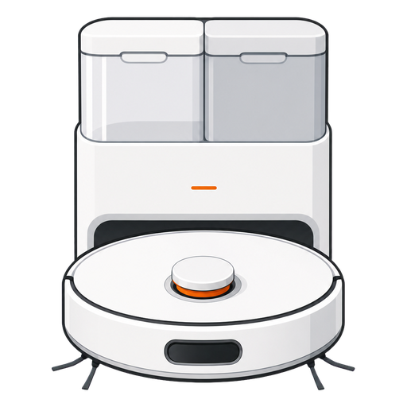

# Xiaomi Robot Vacuum X20 Max dla Home Assistant

<p align="center">
  
</p>

Nieoficjalna integracja przeznaczona wyłącznie dla modelu
`xiaomi.vacuum.d109gl`.

## Funkcje

- pełne sterowanie odkurzaczem i stacją Omni;
- ID i nazwy pomieszczeń z aktualnej mapy;
- sprzątanie jednego lub wielu pomieszczeń po ID albo nazwie;
- tryb pracy, moc, ilość wody, 1–3 przejazdy i wybór trasy;
- bateria, historia, błędy oraz trwałość materiałów eksploatacyjnych;
- ustawienia dywanów, przeszkód, detergentu i trybu DND;
- przyciski mapowania oraz zerowania liczników;
- polskie i angielskie tłumaczenie.

## Wymagania

- Home Assistant 2026.7.0 lub nowszy;
- Xiaomi Robot Vacuum X20 Max (`xiaomi.vacuum.d109gl`);
- robot dodany do aplikacji Xiaomi Home;
- oficjalna integracja **Xiaomi Home** skonfigurowana w Home Assistant dla
  tego samego konta i regionu — dostarcza pierwszy grant OAuth;
- dostęp HA do `*.ha.api.io.mi.com`.

## Instalacja przez HACS

1. Otwórz **HACS → Integracje → Niestandardowe repozytoria**.
2. Dodaj `https://github.com/SmartServicePL/xiaomi-x20-max` jako
   repozytorium typu **Integracja**.
3. Zainstaluj **Xiaomi Robot Vacuum X20 Max** i uruchom ponownie HA.
4. Wejdź w **Ustawienia → Urządzenia i usługi → Dodaj integrację**.
5. Wyszukaj integrację i wybierz robota.

Jeśli pojawi się błąd OAuth, najpierw skonfiguruj lub przeładuj oficjalną
integrację Xiaomi Home, a następnie spróbuj ponownie.

## Sprzątanie pomieszczeń

```yaml
action: xiaomi_x20_max.clean_rooms
data:
  entity_id: vacuum.moj_x20_max_sterowanie
  rooms:
    - Kuchnia
    - 10
  mode: vacuum_and_mop
  suction: turbo
  water_level: medium
  passes: 2
  route: careful
```

ID i nazwy są dostępne w sensorze **Pomieszczenia i ID**.

## Prywatność

Integracja jednorazowo importuje grant OAuth oficjalnej integracji Xiaomi
Home, zapisuje go we własnym magazynie HA i później samodzielnie odświeża.
Nie zapisuje hasła konta ani lokalnych tokenów urządzeń. Diagnostyka ukrywa
identyfikator chmurowy i nazwy pomieszczeń.

## Ograniczenia

- komunikacja odbywa się przez chmurę Xiaomi;
- obsługiwane jest jedno konto/region Xiaomi na instalację HA;
- brak renderowania mapy;
- model nie udostępnia procentowego poziomu czystej i brudnej wody.

Projekt nie jest powiązany z Xiaomi.
